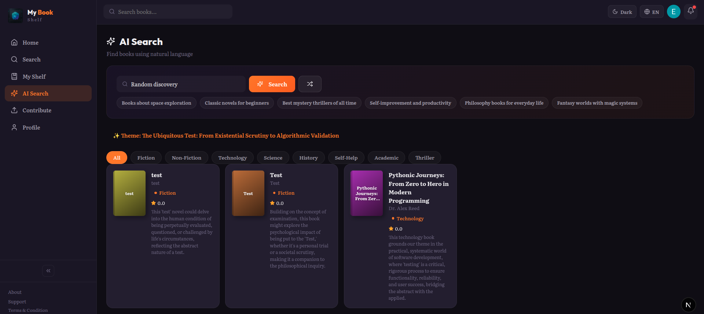
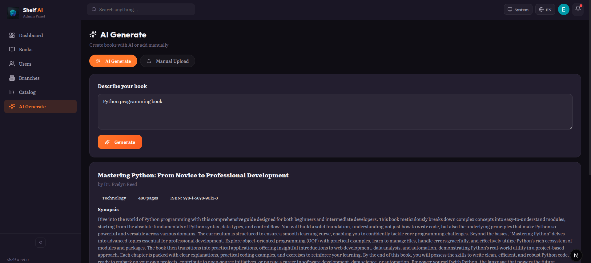
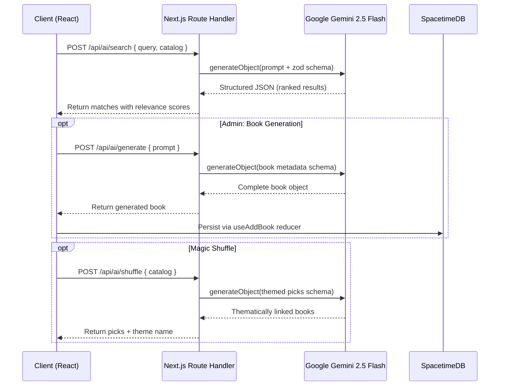
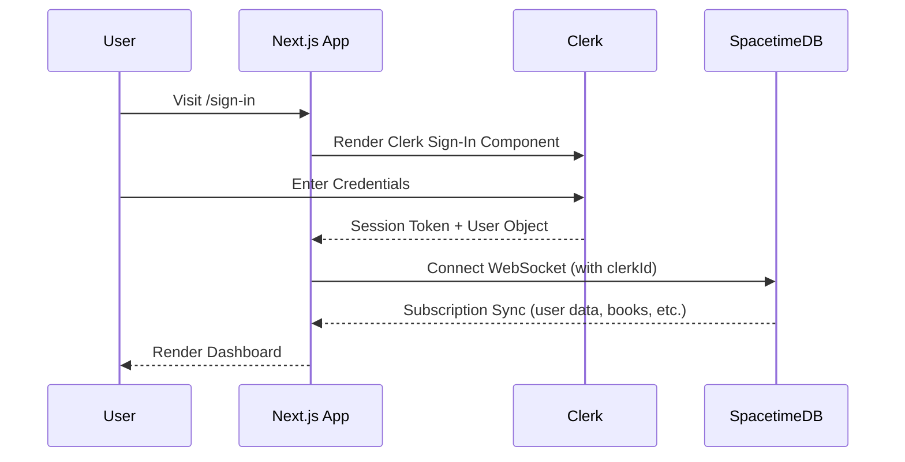
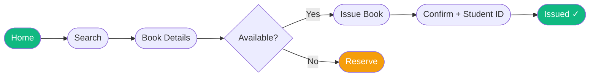
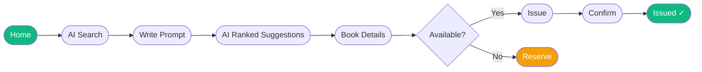
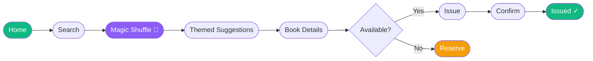
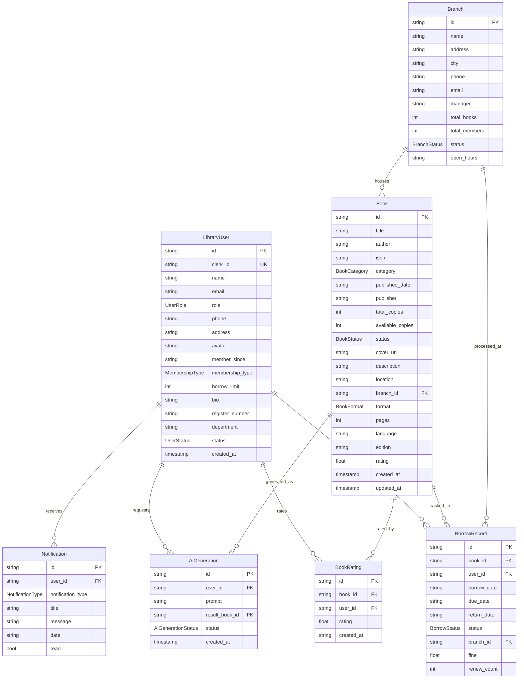

<h1 align="center">Shelf AI | Intelligent Library Management System</h1>

<p align="center">
  <strong>AI-Powered Library System with Real-Time Data Sync</strong>
</p>

| <a href="https://shelfai.up.railway.app"></a> | <a href="https://shelfaiadmin.up.railway.app"></a> |
| :----------------------------------------------------------------------------------------------------------------------------------------------------------------------------------------------------------------------------------: | :-----------------------------------------------------------------------------------------------------------------------------------------------------------------------------------------------------------------------------------------: |
|                                                                <a href="https://shelfai.up.railway.app"></a>                                                                |                                                                <a href="https://shelfaiadmin.up.railway.app"></a>                                                                |

<p align="center">
  
  
  
  
  
  
  
  
  
  
  <a href="https://creativecommons.org/licenses/by-nc/4.0/">
    
  </a>
</p>

<p align="center">
  <a href="https://github.com/littlestmo/shelf-ai/actions/workflows/admin-build.yml"></a>
  <a href="https://github.com/littlestmo/shelf-ai/actions/workflows/user-build.yml"></a>
  <a href="https://github.com/littlestmo/shelf-ai/actions/workflows/lint.yml"></a>
  <a href="https://github.com/littlestmo/shelf-ai/actions/workflows/typecheck.yml"></a>
  <a href="https://github.com/littlestmo/shelf-ai/actions/workflows/prettier.yml"></a>
  <br />
  <a href="https://github.com/littlestmo/shelf-ai/actions/workflows/security-audit.yml"></a>
  <a href="https://github.com/littlestmo/shelf-ai/actions/workflows/server-clippy.yml"></a>
  <a href="https://github.com/littlestmo/shelf-ai/actions/workflows/server-fmt.yml"></a>
</p>

## Overview

Shelf AI is an AI-powered library management system built as a Turborepo monorepo. It features two Next.js 16 dashboards (admin and user), a Rust-based SpacetimeDB server module, and shared UI/logic packages. AI capabilities, semantic search, book generation, and magic shuffle, are powered by Google Gemini via the Vercel AI SDK.

## Monorepo Structure

```
shelf-ai/
├── apps/
│   ├── admin/          → Admin dashboard (Next.js, port 3001)
│   ├── user/           → User dashboard (Next.js, port 3002)
│   └── server/         → SpacetimeDB module (Rust/WASM)
├── packages/
│   ├── ui/             → Shared React component library
│   ├── shared/         → Hooks, types, schemas, constants, i18n
│   ├── eslint-config/  → Shared ESLint configuration
│   └── typescript-config/ → Shared TSConfig presets
├── docs/tutorials/     → Setup and integration guides
├── turbo.json          → Turborepo pipeline config
└── pnpm-workspace.yaml → Workspace definition
```

## Architecture

Traditional library apps use REST APIs with PostgreSQL. Shelf AI replaces this with **SpacetimeDB**, a serverless database where backend logic runs as WASN modules. Clients subscribe to table changes over WebSockets and receive real-time delta updates, eliminating polling and HTTP round-trips entirely.

### Data Synchronization Flow

```mermaid
sequenceDiagram
    participant C as Next.js Client
    participant WS as WebSocket Connection
    participant W as WASM Reducer
    participant T as In-Memory Tables

    rect rgb(15, 42, 30)
    Note over C: Action Dispatched
    C->>WS: Call Reducer (e.g. addBook)
    WS->>W: Execute WASM Logic
    W->>T: Mutate In-Memory State
    T-->>WS: Broadcast Delta to Subscribers
    WS-->>C: onUpdate Callback → React Re-render
    Note over C: UI Updated Instantly
    end
```



### AI Features Architecture



### Authentication Flow



## User Flows

### Book Search and Issue



### AI-Powered Search



### Magic Shuffle Discovery



### Book Return


### Admin: AI Book Generation


## Database Schema



## AI Capabilities

| Feature         | Endpoint                | Description                                  |
| :-------------- | :---------------------- | :------------------------------------------- |
| Semantic Search | `POST /api/ai/search`   | Natural language queries ranked by relevance |
| Book Generation | `POST /api/ai/generate` | Complete book metadata from a text prompt    |
| Magic Shuffle   | `POST /api/ai/shuffle`  | Thematically linked book discovery           |

## Scripts

| Command            | Description                                    |
| :----------------- | :--------------------------------------------- |
| `pnpm dev`         | Start all dev servers via Turborepo            |
| `pnpm build`       | TypeScript check + production build (all apps) |
| `pnpm lint`        | ESLint strict checks across monorepo           |
| `pnpm check-types` | TypeScript verification for all packages       |
| `pnpm format`      | Prettier formatting                            |

## Getting Started

### Prerequisites

- Node.js 22+
- pnpm 9+
- Rust toolchain (for SpacetimeDB server module)
- SpacetimeDB CLI (`spacetime`)

### Quick Start

```sh
git clone <repo-url>
cd turbo
pnpm install
```

### Environment Setup

Copy and configure `.env.local` in both `apps/user/` and `apps/admin/`:

```env
NEXT_PUBLIC_CLERK_PUBLISHABLE_KEY=pk_test_...
CLERK_SECRET_KEY=sk_test_...
NEXT_PUBLIC_CLERK_SIGN_IN_URL=/sign-in
NEXT_PUBLIC_CLERK_SIGN_UP_URL=/sign-up
NEXT_PUBLIC_CLERK_AFTER_SIGN_IN_URL=/home
NEXT_PUBLIC_CLERK_AFTER_SIGN_UP_URL=/home
NEXT_PUBLIC_SPACETIMEDB_URI=http://localhost:3000
NEXT_PUBLIC_SPACETIMEDB_MODULE=shelf-ai
GOOGLE_GENERATIVE_AI_API_KEY=your_key_here
```

### Deploy SpacetimeDB Module

```sh
cd apps/server
spacetime start

# on a separate terminal:
spacetime publish -s local shelf-ai
```

### Run Development Servers

```sh
pnpm dev
```

Admin: `http://localhost:3001` · User: `http://localhost:3002`

## Tutorials

| Guide                                                | Description                                   |
| :--------------------------------------------------- | :-------------------------------------------- |
| [Environment Setup](docs/tutorials/setup-env.md)     | Configure all environment variables           |
| [Clerk Auth Setup](docs/tutorials/clerk-setup.md)    | Get Clerk API keys step by step               |
| [Google AI Setup](docs/tutorials/google-ai-setup.md) | Get Gemini API key from Google AI Studio      |
| [SpacetimeDB Setup](docs/tutorials/spacetime-db.md)  | Install CLI, publish module, connect client   |
| [AI Integration](docs/tutorials/ai-integration.md)   | How the Vercel AI SDK is used in the codebase |
| [i18n Setup](docs/tutorials/i18n-setup.md)           | Internationalization with react-i18next       |

## License

<p>
  <a href="https://creativecommons.org/licenses/by-nc/4.0/">
    
  </a>
</p>

This work is licensed under the [Creative Commons Attribution-NonCommercial 4.0 International License](https://creativecommons.org/licenses/by-nc/4.0/).
