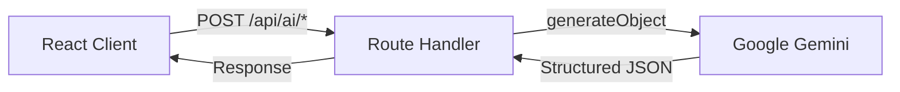

# AI Integration with Vercel AI SDK

How Shelf AI uses the Vercel AI SDK to power semantic search, book generation, and magic shuffle.

## Stack

| Layer    | Technology                           |
| :------- | :----------------------------------- |
| SDK      | `ai` (Vercel AI SDK v6)              |
| Provider | `@ai-sdk/google` (Gemini 2.5 Flash)  |
| Schema   | `zod` (structured JSON output)       |
| Runtime  | Next.js Route Handlers (server-side) |

## Architecture

All AI operations run server-side inside Next.js Route Handlers. The client sends context (catalog data, user query) and receives structured JSON responses.



## API Routes

### `POST /api/ai/generate` (Admin)

Generates a complete book entry from a prompt. Returns title, author, synopsis, chapters, ISBN, category, pages, and more.

Located at: `apps/admin/app/api/ai/generate/route.ts`

### `POST /api/ai/search` (User)

Accepts a natural language query and the library catalog. Returns ranked book IDs with relevance scores and explanations.

Located at: `apps/user/app/api/ai/search/route.ts`

### `POST /api/ai/shuffle` (User)

Picks 4-6 books from the catalog that share a surprising thematic connection. Returns the picks and the theme name.

Located at: `apps/user/app/api/ai/shuffle/route.ts`

## Key Pattern

All routes follow the same pattern:

1. Define a `zod` schema for the expected output
1. Call `generateObject` with `output: "object"` and the schema
1. Return the structured result as JSON

```typescript
import { generateObject } from "ai";
import { google } from "@ai-sdk/google";
import { z } from "zod";

const schema = z.object({ title: z.string(), author: z.string() });

const { object } = await generateObject({
  model: google("gemini-2.5-flash"),
  output: "object",
  schema,
  prompt: "Generate a book about...",
});
```
