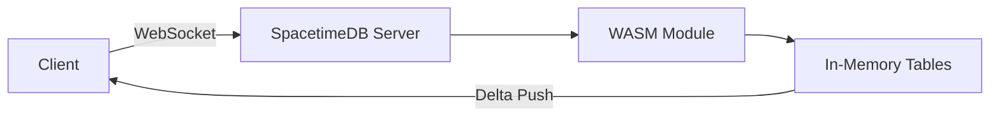

# SpacetimeDB Integration

How Shelf AI uses SpacetimeDB for real-time data synchronization instead of traditional REST APIs.

## Prerequisites

1. Install the Rust toolchain: [rustup.rs](https://rustup.rs)
1. Install the SpacetimeDB CLI:

```sh
curl -sSf https://install.spacetimedb.com | sh
```

## How It Works

SpacetimeDB runs your backend logic as a WebAssembly module. Clients connect via WebSockets and subscribe to table changes. When a reducer mutates state, all subscribed clients receive the delta instantly, no HTTP polling required.



## Server Module

The Rust server module lives at `apps/server/`. It defines tables and reducers:

```toml
[package]
name = "shelf-ai-server"
edition = "2024"

[dependencies]
spacetimedb = "=2.0.2"
```

## Deploy Locally

```sh
spacetime start

cd apps/server
spacetime publish -s local shelf-ai
```

## Client Connection

The `@shelf-ai/shared` package provides a `SpacetimeDBProvider` that manages the connection:

```tsx
import { SpacetimeDBProvider } from "@shelf-ai/shared/spacetimedb";

<SpacetimeDBProvider
  uri={process.env.NEXT_PUBLIC_SPACETIMEDB_URI}
  module={process.env.NEXT_PUBLIC_SPACETIMEDB_MODULE}
>
  {children}
</SpacetimeDBProvider>;
```

## Available Hooks

| Hook              | Description                 |
| :---------------- | :-------------------------- |
| `useBooks()`      | Subscribe to all books      |
| `useUsers()`      | Subscribe to all users      |
| `useBranches()`   | Subscribe to all branches   |
| `useAddBook()`    | Dispatch addBook reducer    |
| `useUpdateUser()` | Dispatch updateUser reducer |
| `useBorrowBook()` | Dispatch borrowBook reducer |
| `useReturnBook()` | Dispatch returnBook reducer |
